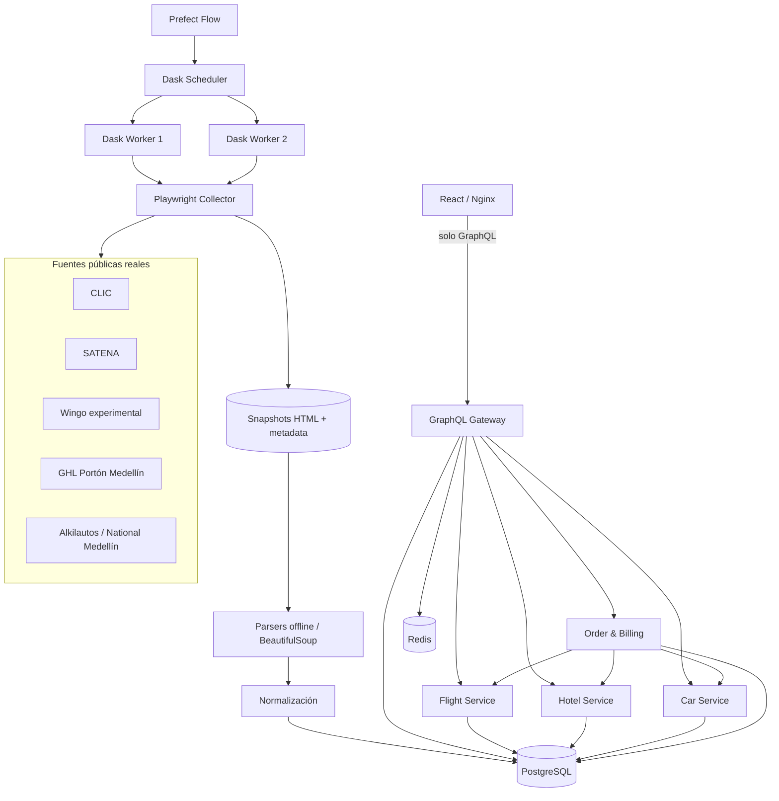

# Arquitectura técnica de WanderSync

## Objetivo

WanderSync separa la **adquisición web real** del **consumo de catálogo**. El navegador del usuario nunca dispara scraping. Prefect actualiza el catálogo de manera independiente; GraphQL y los microservicios consultan únicamente PostgreSQL.

## Vista general



## Pipeline de scraping

```text
Prefect
  ↓
¿snapshot real fresco (<30 min)?
  ├─ sí → CACHED
  └─ no → Dask task → Playwright → fuente pública
                         ↓
                    DOM renderizado
                         ↓
                    page.content()
                         ↓
                 .html + metadata.json
                         ↓
                parse → normalize → UPSERT
                         ↓
                     PostgreSQL
```

Una falla 403/429 persistente, CAPTCHA, timeout o cambio del selector **no se evade**. Si hay snapshot real anterior de máximo 24 h puede usarse como `STALE_FALLBACK`; de lo contrario se registra `SOURCE_UNAVAILABLE`.

## Fuentes y adaptadores

Cada fuente implementa un adaptador con nombre, tipo, URL, allowlist, selector de disponibilidad, parser y normalizador. Los adaptadores iniciales son:

- `clicair`: tabla pública Bogotá–Medellín de CLIC, habilitada por defecto.
- `satena`: tabla pública Bogotá–Medellín de SATENA, habilitada por defecto.
- `wingo`: adaptador experimental conservado pero desactivado por defecto por challenges observados.
- `ghl_porton_medellin`: habitaciones/tarifas públicas de GHL Portón Medellín.
- `alkilautos_national_medellin`: modelos/tarifas públicas de National en Alkilautos Medellín.

Playwright no interpreta el negocio: solo navega, espera el selector y devuelve HTML. Los parsers operan offline sobre el snapshot. Esto permite repetir parsing y pruebas sin volver a generar tráfico externo.

## Dask y Prefect

Prefect expone el flow `WanderSync real scraping ingestion`. Sus etapas son `collect`, `parse`, `normalize` y `persist`. El trabajo de cada etapa se envía al scheduler Dask mediante Futures. Scheduler, workers y runner comparten la misma imagen `./ingestion` y `PYTHONPATH=/app` para evitar incompatibilidades de serialización.

La adquisición se serializa por fuente mediante un lock compartido. `SCRAPE_MAX_CONCURRENCY_PER_SOURCE=1` es una política deliberada; el paralelismo se aprovecha principalmente en el procesamiento posterior al snapshot.

## Persistencia y procedencia

Cada oferta activa conserva:

```text
source
source_url
snapshot_id
scraped_at
active
```

`scrape_snapshots` conecta un `snapshot_id` con archivo, hash SHA-256, URL, fecha y estado. `scrape_runs` registra cada ciclo de adquisición/procesamiento, su resultado y número de elementos.

## Reserva y SAGA

El catálogo representa **ofertas observadas**, no inventario externo. WanderSync **no realiza reservas en los proveedores externos** y no afirma cuántos asientos/habitaciones/unidades posee el proveedor.

Cuando el usuario confirma un paquete, Flight/Hotel/Car crean un **WanderSync Local Hold** sobre IDs de ofertas scrapeadas activas. Order Service orquesta esos holds y Billing local mediante SAGA. Una falla compensa en orden inverso. Cancelar un hold nunca modifica el registro scrapeado.

## Límites de seguridad del collector

- esquema únicamente HTTP/HTTPS;
- hostname en allowlist exacta del adaptador;
- localhost e IPs no globales rechazadas;
- resolución DNS validada antes de navegar;
- `robots.txt` respetado;
- User-Agent académico identificable;
- una navegación simultánea por fuente;
- pacing de 90–180 s por defecto;
- retries acotados;
- ningún bypass de CAPTCHA/challenge/403.

## Comunicación

- Navegador → backend: únicamente GraphQL.
- Gateway → servicios: HTTP privado de Docker.
- Order → servicios: HTTP privado.
- Prefect/runner → Dask: scheduler TCP.
- Workers → páginas públicas: HTTPS controlado.
- Workers → PostgreSQL: persistencia del catálogo y procedencia.
- Todos los procesos de ingesta → `scrape_snapshots` compartido.

## Red multi-ciudad de vuelos

La capa de vuelos ya no está limitada a una pareja fija. `ingestion/sources/flight_routes.py` contiene un registry auditable de rutas para CLIC, SATENA y LATAM. Cada `RouteSpec` describe una URL pública, origen/destino aeroportuario y modo de adquisición HTTP; el registry expresa qué páginas pueden consultarse, no qué rutas están disponibles.

El Flight Service deriva `/routes` exclusivamente de `flights.active=TRUE`. El Gateway transforma esos pares aeroportuarios en un grafo turístico con `travelNetwork`. Bogotá (`BOG`), Medellín (`MDE` resolviendo `MDE/EOH`), Cali (`CLO`), Cartagena (`CTG`) y Santa Marta (`SMR`) son las ciudades soportadas en esta fase.

El frontend consume ese grafo en dos modos: **Explorar vuelos**, que permite cualquier arista activa, y **Armar paquete**, que filtra por `packageAvailable=true`. Las fechas no se escriben manualmente: provienen de `travelAvailability` y, por tanto, de ofertas scrapeadas activas.

## Pool de vuelos, 20 direcciones y cobertura de 10 ofertas

La red turística usa BOG, MDE/EOH, CLO, CTG y SMR, por lo que expone **20 direcciones** buscables. CLIC, SATENA, JetSMART y Wingo son las cuatro fuentes productivas; LATAM permanece deshabilitada como `ROBOTS_DISALLOWED`. PostgreSQL conserva el catálogo real completo y el read model selecciona como máximo **10 ofertas** visibles por dirección.

Los estados de cobertura son `AVAILABLE`, `PARTIAL`, `NO_OFFERS` y `SOURCE_UNAVAILABLE`. `flightSearch` es direct-first y solo calcula una **conexión sugerida** de máximo una escala cuando no existen directos para la fecha. La advertencia es: **Verifica los horarios exactos con las aerolíneas.** Las conexiones no se persisten ni entran en el SAGA.

Los paquetes permanecen direct-only y usan GHL + Alkilautos para el alcance actual. `STALE_FALLBACK` reutiliza únicamente snapshots reales. WanderSync no realiza reservas en los proveedores externos; la SAGA usa WanderSync Local Hold.
