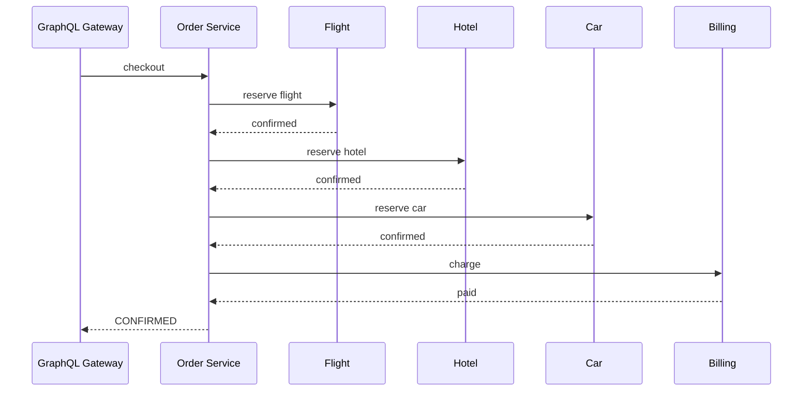
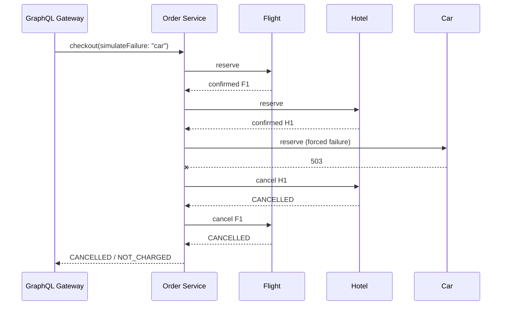

# Patrón SAGA

WanderSync usa **SAGA por orquestación**. `order-service` conoce el proceso y conserva la secuencia de acciones/compensaciones en `saga_events`.

## Happy path

## Falla en vehículo y compensación

## Fallas disponibles para demo

- `flight`: falla antes de confirmar recursos.
- `hotel`: compensa vuelo.
- `car`: compensa hotel y vuelo.
- `billing`: compensa auto, hotel y vuelo.

Las fallas solo se aceptan cuando `ALLOW_FAILURE_INJECTION=true`.

## SAGA de dos vuelos

El orden aprobado es `outbound_flight → return_flight → hotel → car → billing`. Una falla inyectada como `return_flight` debe compensar el hold de `outbound_flight`. Los dos vuelos son WanderSync Local Holds y el sistema no realiza reservas en los proveedores externos.
